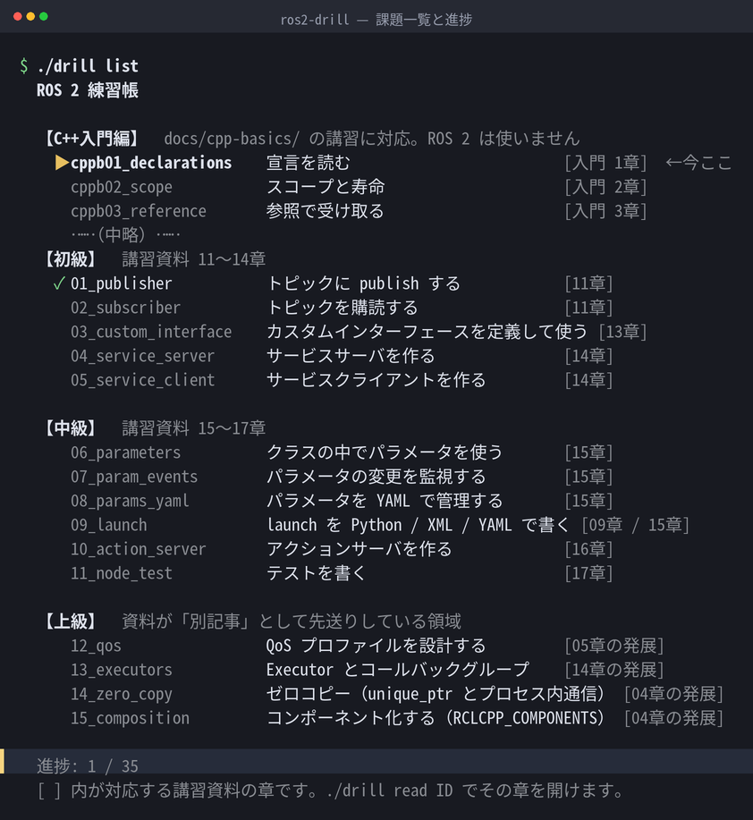
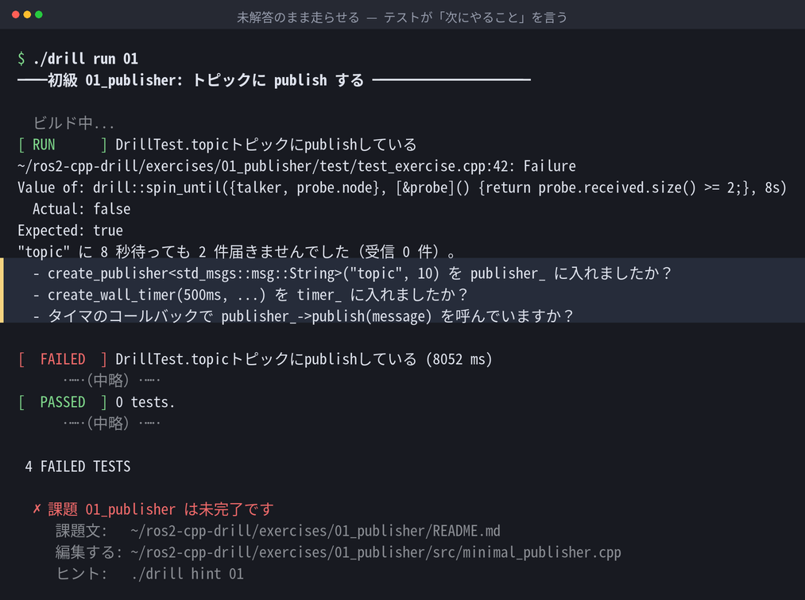
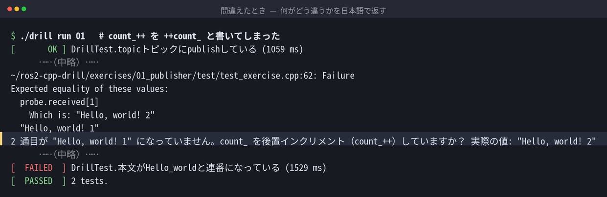
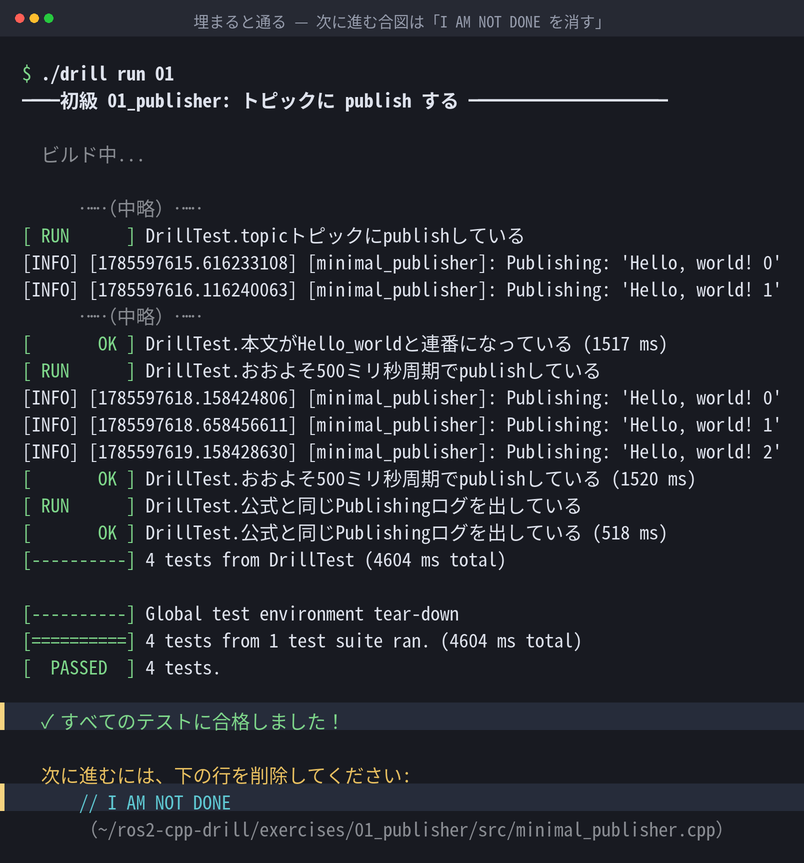
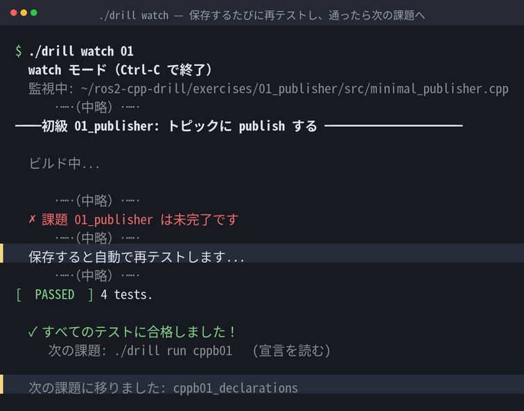
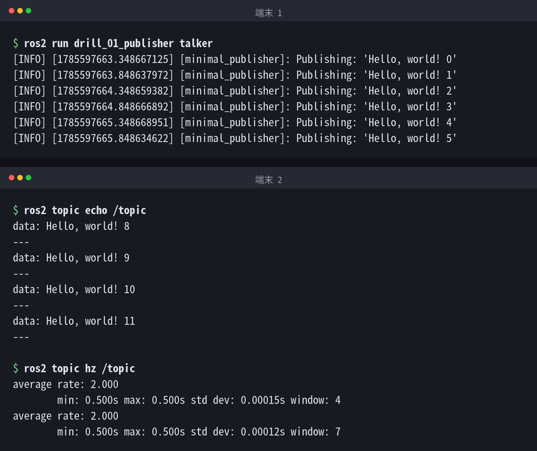

# 発表資料（スライド）

この教材について発表するときのスライドです。**尺ごとに 3 本**あります。
ブラウザでそのまま開けます（ダウンロードも同じリンクから）。

| 尺 | 枚数 | PDF |
| --- | --- | --- |
| **3分**（LT） | 6 | [slides-3min.pdf](発表資料/slides-3min.pdf) |
| **5〜10分** | 18 | [slides-10min.pdf](発表資料/slides-10min.pdf) |
| **15分** | 26 | [slides-15min.pdf](発表資料/slides-15min.pdf) |

3本とも柱は同じで、**課題 `01_publisher` を実際に解く**流れを軸にしています。
未解答で落とす → `hint` → わざと間違える → 通す → `watch` → 実機で動かす、の順です。

**原本も置いてあります → [slides-src.zip](発表資料/slides-src.zip)**（2MB ほど）。
[Marp](https://marp.app/) 記法の Markdown と画像、それを PDF に焼くスクリプトが入っています。
展開して `python3 slides/tools/md2pdf.py` を叩けば作り直せます（Chromium だけ使います）。
自分の講習用に書き換えて使ってもらって構いません（MIT）。

<iframe src="発表資料/slides-10min.pdf#view=FitH" width="100%" height="520"
        style="border:1px solid #d3d7e0; border-radius:6px;"
        title="スライド（5〜10分版）"></iframe>

うまく表示されない環境では [slides-10min.pdf](発表資料/slides-10min.pdf) を直接開いてください。

## 話している内容

### 動機

ROS 2 を始めた年は、公式チュートリアルの `create_publisher` が読めませんでした。
止まった原因は ROS ではなく、テンプレート・`shared_ptr`・`std::bind` です。
その翌年に教える側へ回ると、今度は別の問題が出ます。**課題を出しても、
自分が見ないと合否が出ない。** 同じ質問が人数分来ます。

だから、**採点する人が要らない課題**にしました。Rust の
[rustlings](https://rustlings.rust-lang.org/) がやっていた形を ROS 2 に持ってきています。

### 全 35 問と、その進捗

`[11章]` が対応する読み物の章です。`./drill read 01` でその章が開きます。
逆に、章の末尾の「対応する課題」から課題へも辿れます。

### 埋めずに走らせると、テストが次の一手を言う

落ちたテストの中に、次にやることが日本語で入っています。
`create_publisher` の戻り値を**ローカル変数で受けてしまう**のが最頻のつまずきなので、
「`publisher_` に入れましたか？」まで書いてあります。

### 間違え方まで拾う

`count_++` を `++count_` と書いた場合です。コンパイルは通り、publish もできていて、
それでも 1 通目が `Hello, world! 0` になりません。

4問のうち2問は通ります。落ちた2問が「**`count_` を後置インクリメント（`count_++`）
していますか？**」と、実際の値つきで返します。
人間のレビュアーが指摘していた粒度を、失敗メッセージに埋めてあります。

### 直すと通る

通っただけでは次に進みません。`// I AM NOT DONE` を自分で消すのが完了の合図です。

### 普段の使い方

`./drill watch` を開いたまま書きます。保存 → 再ビルド → 再テストが自動で回り、
通ったら次の課題へ進みます。

### 出来上がるのは、普通の ROS 2 ノード

`ros2 topic hz` が 2.000 Hz。500ms 周期のタイマがそのとおり動いています。
ドリル用の閉じた世界ではなく、公式チュートリアルと同じものが手元に残ります。

## 載せている出力について

**スライドの端末画像は、すべて実際に走らせた出力です。**
長い出力から行を落とした箇所には `……（中略）……` を入れ、
リポジトリの絶対パスだけ `~/ros2-cpp-drill` に縮めてあります。文言は変えていません。

環境は Ubuntu 24.04 / ROS 2 Jazzy / g++ 13.3.0 です。

## 関連

- [教材の全体像](README.md) — 読み物と課題の対応
- [はじめかた](はじめかた.md) — 手元で動かす
- [ROS2講習11: C++でpub/subを書く](ros2/11_C++でpub_subを書く.md) — 実演した課題に対応する章
